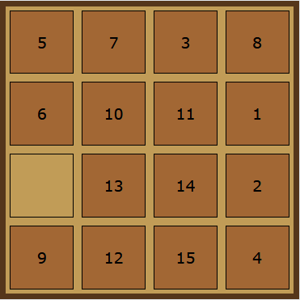
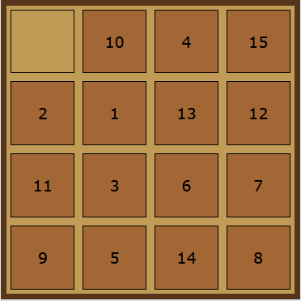

## Serial and Parallel( using MPI) impelmentations of IDA* for solving the sliding puzzle problem 

This repo contains 2 programs:  

##### 1. Serial implementation of the IDA\* algorithm, found in the NoOptimization folder  
The program can take up to **1** argument:  
* **1 number** and the puzzle will be of the size **number**\***number** and be shuffled randomly  
* **A serialized puzzle**, the puzzle is considered already shuffled
* **A file** containing a serialized puzzle on the first line, the puzzle is considered already shuffled
* **No argument** given then the puzzle will be **4**\***4** and shuffled randomly 
##### 2. Parallel implementation, found in the Optimization folder  
The program can take as the first argument the same stuff as the serial implementation.  

By default the program will go down the tree of moves until every process created has at least **1 unique** point from which to apply IDA\*  

This behaviour can be changed by also giving the program the __DEPTH__ argument as well a number representing how
many levels down the tree it must go before starting to solve the problem, if no number is given with the __DEPTH__ argument the the 
default depth of **5** will be taken

**The order of the arguments is not interchangable**  
**To run this MPI must be installed** and run as this  
`mpiexec -n 5 "Path_to_executable" argument_1 argument_2 argument_3`  
where **5** is the number of processes that will be used, do remember that **1 process is used to manage communications** so 
n-1 processes actually try to solve the problem

***

The folder Puzzle Visualizer contains a simple HTML page that takes a serialized puzzle and creates a visualisation of it.

The data folder contains the puzzles and results to the experiment.

Documentation.pdf contains a more in-depth talk about the program and compares results of the experiment.

***

A serialized puzzle has the following form  
**size_of_board|piece1|...|pieceN*N|**  
and the empty piece is noted with **-1**

For example:

is serialized as  
**4|5|7|3|8|6|10|11|1|-1|13|14|2|9|12|15|4|**  

and  

  
as  
**4|-1|10|4|15|2|1|13|12|11|3|6|7|9|5|14|8|**
